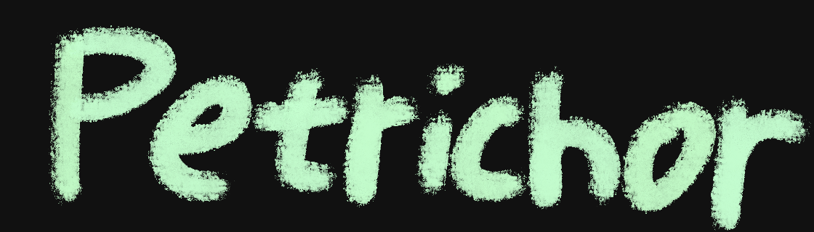
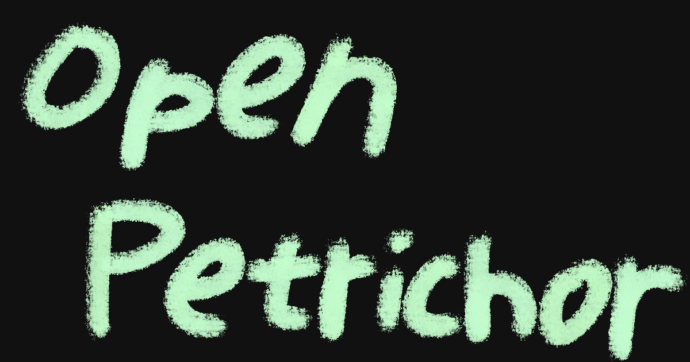

**Petrichor は、軽量でセルフホスト可能なSNSを目指して開発している、オープンソースのSNSアプリケーションです。**

<h2 align="center">What is Petrichor?</h2>

- **セルフホスト** — 自分のサーバーで運用できるSNSを目指しています。
- **軽量** — 小さなサーバーでも動かせる、軽量なSNSを目指しています。
- **つながる** — 他のPetrichorサーバーを見つけ、ゆるくつながれる仕組みを目指しています。
- **リアルタイム** — Ioliteを通して、リアルタイムに人と交流できる空間を目指しています。

<h2 align="center">Features</h2>

<h3 align="center">Iolite</h3>
Iolite は、平面空間で自然に会話できることを目指したPetrichorのボイスチャット機能です。  
ユーザー同士の距離によって音声の聞こえ方が変わる、軽量で気軽な会話空間を目指しています。

<h2 align="center">Planned Features</h2>

<h3 align="center">Fluorite</h3>

Fluorite は、円形に広がるツリー構造でコミュニティを探索できる、Petrichorのチャット機能として開発を予定しています。  
話題やチャンネルをノードとしてつなぎ、コミュニティ全体を視覚的にたどれる空間を目指しています。

<h2 align="center">Getting Started</h2>

<h3 align="center">Use in Browser</h3>

    

<h3 align="center">Self-hosting</h3>

Self-hosting support is currently under development.

<h2 align="center">Documentation</h2>

[User Guide](./docs/user-guide.md) 
[Development Guide (日本語)](./DEVELOPMENT.md) 
[Development Guide (English)](./DEVELOPMENT.en.md)

<h2 align="center">License</h2>

Petrichor は Apache License 2.0 のもとで公開されています。詳しくは [LICENSE](./LICENSE) をご覧ください。

Petrichor is licensed under the Apache License 2.0. See [LICENSE](./LICENSE) for details.
